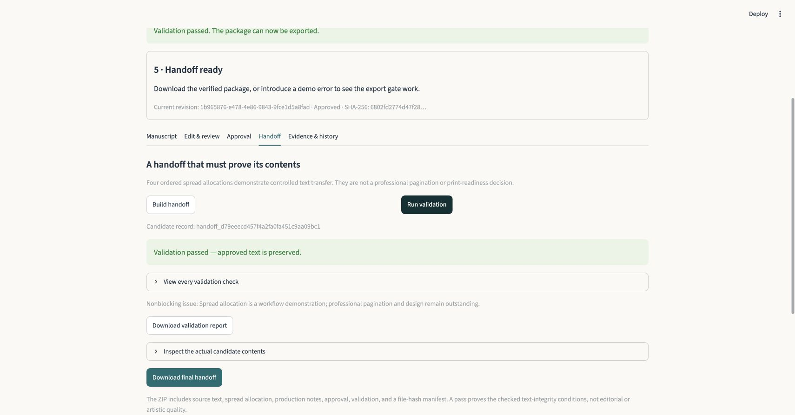

# Manuscript to Handoff

**AI-assisted publishing operations with human approval and verifiable production handoffs.**

[](https://github.com/salimocasio-dev/manuscript-to-handoff/actions/workflows/ci.yml)

An editorial suggestion is useful only if someone can review it. An approved manuscript is useful only if the next person receives the same text. This application connects those two problems in one working workflow:

Sample manuscript → editorial suggestions → human review → approved revision → production candidate → deterministic validation → handoff ZIP.

The demonstration deliberately removes a manuscript line or uses an earlier revision. The validator checks the changed artifact against the approved source and blocks export. Rebuilding the candidate and validating it again restores the handoff.



## What this demonstrates

- Product thinking around a real editorial-to-production failure mode.
- A human-in-the-loop boundary where suggestions, decisions, revisions, and approval remain separate.
- Deterministic checks of the artifact a production partner actually receives, rather than trust in generated metadata.
- Reproducible evidence: executable failure/recovery scenarios, 66 automated tests, a real-server smoke check, and CI.

## Run locally

Use Python 3.12 in a POSIX shell:

```bash
git clone https://github.com/salimocasio-dev/manuscript-to-handoff.git
cd manuscript-to-handoff
python3.12 -m venv .venv
source .venv/bin/activate
python -m pip install -r requirements.txt
streamlit run app.py
```

Open the local URL printed by Streamlit, usually `http://localhost:8501`. The included sample and authored editorial fixture need no credentials. By default, each browser session gets an isolated in-memory workspace; its data is not written to disk and disappears when that session ends or is reset.

For durable local history across app restarts, explicitly configure a SQLite file:

```bash
export MTH_DB_PATH="$PWD/data/workflow.sqlite3"
streamlit run app.py
```

Each configured workspace has one current manuscript and a linear revision history. Do not paste confidential text into a deployment you do not control.

## Demonstrate the workflow

1. Under **Manuscript**, click **Load sample manuscript**.
2. Under **Edit & review**, keep **Recorded demo (authored fixture; no API call)** and click **Generate suggestions**. Accept the first suggestion, reject the second, then click **Save review decisions**. The accepted change creates an unapproved revision.
3. Under **Approval**, review the text, check **I approve this exact revision for the production handoff**, and click **Approve current revision**.
4. Under **Handoff**, click **Build handoff**, then **Run validation**. **Download final handoff** becomes available.
5. Click **Remove a manuscript line**, then **Run validation**. Inspect the failed source-coverage and reconstruction checks. The final download is blocked; the failure report remains downloadable.
6. Click **Rebuild from approved revision**, then **Run validation**. Export becomes available again.
7. Click **Use earlier revision**, then **Run validation** to demonstrate the revision check. Rebuild and validate once more to recover.

**Evidence & history** retains the earlier text, decisions, approvals, and both successful and failed validation runs. The [walkthrough script](docs/walkthrough.md) explains the same sequence in roughly two minutes.

## Reproduce the evidence

```bash
pytest -q
python scripts/run_demo.py --output artifacts/demo
```

The demo script runs the real store, editorial fixture, generator, validator, and export boundary. Its approval is explicitly labeled as a scripted test action. It writes a clean handoff ZIP, actual failure reports, and machine-readable evidence. Choose a new output directory for each run; the script refuses to overwrite existing evidence. Fresh revision IDs and timestamps mean separate runs are expected to have different package hashes.

Actual example outputs are included under [examples/output](examples/output). The [execution record](examples/output/evidence.json) shows the clean ZIP passed; missing, duplicated, altered, reordered, and wrong-revision candidates were rejected with export blocked; rebuilding recovered successfully. These are generated artifacts from the fictional sample, not private publishing work.

**Executed verification:** 66 pytest tests passed: 16 store tests, 28 handoff tests, 14 editorial tests, and eight Streamlit AppTest workflows. AppTest exercised the actual application's widgets and backend through success, blocked export, recovery, persistent history, session isolation/reset, and fail-closed live mode. A real-browser walkthrough covered the complete recorded workflow, navigation across reruns, validation failure/recovery, and final ZIP download. The real HTTP server, health endpoint, and frontend asset also passed a smoke check (`python scripts/smoke_server.py`). See the [test report](examples/test-results.xml) and [verification record](docs/verification.md).

To independently recheck the included ZIP against source and approval records outside that ZIP:

```bash
python scripts/verify_package.py examples/output/clean_handoff.zip \
  --source examples/output/intended_revision.json \
  --approval examples/output/approval.json \
  --candidate examples/output/clean_candidate.json
```

The command prints the actual package checks and exits with status 1 on validation failure. When checking your own package, supply the corresponding trusted source and approval records; files copied from the package cannot establish independent approval.

## Recorded example and live AI

The recorded example is an **authored fixture**, not a recording of a successful provider response. It makes no model call and supports only the exact original sample. A changed or custom manuscript requires live review, or you can review and approve the text yourself.

Live mode uses the OpenAI Responses API with a structured response schema. Set environment variables before starting Streamlit:

```bash
export OPENAI_API_KEY='your-api-key'
export OPENAI_MODEL='gpt-6-astra'
export MTH_ENABLE_LIVE_AI=1
streamlit run app.py
```

`.env.example` documents these variables; the app does **not** load a `.env` file automatically. Live calls are fail-closed: an API key alone does not expose the provider option. Choose a model available to your account that supports structured outputs. In the app, select **Live model** and acknowledge sending the manuscript to OpenAI before generating suggestions. A provider error is displayed; it never silently switches to the fixture.

The integration follows the official [Structured Outputs documentation](https://developers.openai.com/api/docs/guides/structured-outputs), checked September 9, 2026. **Live API execution remains unverified:** no credentials were available. Adapter behavior is covered with mocked responses; that is not evidence of a successful live call.

## What the handoff contains

| File | Purpose |
| --- | --- |
| `manuscript.txt` | Exact approved UTF-8 text |
| `spreads.json` | Four ordered allocations with exact source offsets and text |
| `production_brief.md` | Transfer instructions and remaining production decisions |
| `issues.json` | Nonblocking warnings and any blocking production issues |
| `approval.json` | Revision, hash, reviewer label, and approval timestamp |
| `candidate.json` | Complete candidate as checked at the export boundary |
| `validation_report.json` | Candidate checks against the independent approved source |
| `manifest.json` | SHA-256 hashes for every other package file |

The export code reopens the actual ZIP and validates its files before returning bytes for download. A manifest that agrees with altered text is insufficient: the manuscript and allocated spans must still match the independent source revision.

## Scope and limits

- Approval is a separate human action tied to one revision and content hash. A new draft requires fresh approval; historical approvals remain in history.
- Source spans use half-open Unicode code-point offsets. Content hashes use exact UTF-8 bytes. Punctuation, line endings, whitespace, and Unicode composition are not normalized. File import preserves original line endings; browser editing preserves the text the browser submits.
- This is a public, local-first portfolio prototype. Its default demo workspace is isolated per browser session; durable file storage is explicit. Reviewer labels are not authenticated identities. Database guards prevent accidental mutation through ordinary application use; they do not make a locally editable database tamper-proof.
- A hosted production or shared-team version would still need authenticated users, resource limits, durable tenant-isolated storage, and managed provider-key controls.
- The fixed four-spread allocation demonstrates text transfer. A validation pass does not establish editorial quality, professional pagination, typography, illustration quality, or print readiness.
- The sample and fixture were purpose-written with AI assistance. No unpublished manuscripts, private artwork, correspondence, or customer data are included. No customer adoption, revenue, or time savings are claimed.

Salim Ocasio supplied the product brief and workflow requirements; implementation and documentation were AI-assisted. The application is inspired by his publishing-house workflow. It is a bounded portfolio prototype, published openly for inspection and reproducible evaluation.

Read the [architecture](docs/architecture.md), [case study](docs/case-study.md), and [portfolio description](docs/portfolio.md).

## License

Released under the [MIT License](LICENSE).
