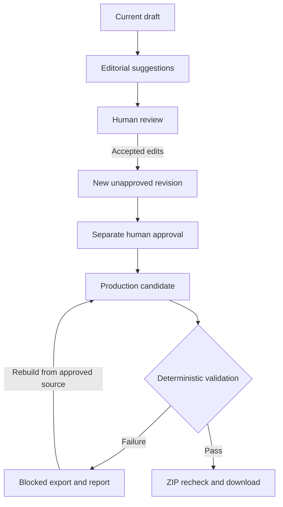

# Architecture

The model proposes edits. The store applies human decisions to a particular source revision. The validator decides whether the actual handoff preserves the approved text. These responsibilities are separate so a fluent suggestion or successful generation step cannot approve its own output.

## Components and boundaries

| Component | Responsibility | Boundary |
| --- | --- | --- |
| `app.py` | Streamlit review, approval, candidate inspection, failure controls, and downloads | Exposes separate review and approval actions; shows persisted validation results |
| `mth/editorial.py` | Authored fixture and optional OpenAI structured suggestions | Receives source text; has no database write or approval capability |
| `mth/store.py` | SQLite revisions, suggestions, decisions, approvals, candidates, and reports | Rejects stale edits; records exact-source approvals and preserves history |
| `mth/handoff.py` | Four-spread candidate creation and ZIP export | Generation cannot declare validity; export calls the independent validator |
| `mth/validation.py` | Candidate and actual ZIP checks | Reads intended source and approval independently of candidate claims |

The authored example supplies suggestions without a network call. Live mode uses one provider and validates the returned revision ID, content hash, and suggestion schema. Provider output remains advice. Exact passage matching in the store rejects missing or ambiguous replacements, overlapping accepted edits, and suggestions for stale revisions.

## Revision and approval model

Every manuscript save records exact text, a UUID, parent revision, creation timestamp, reason, and SHA-256 of its UTF-8 bytes. Applying accepted suggestions creates another draft. Rejecting suggestions records decisions without changing the manuscript. Applying a batch of decisions is transactional, so an invalid accepted replacement does not leave half-applied edits.

Approval records contain a revision ID, hash, reviewer label, and timestamp. The app uses the latest revision and that revision's approval for new handoffs. An old approval remains historically valid for its old text; it cannot authorize a new draft. SQLite mutation guards protect immutable history from accidental updates and deletes through ordinary application code.

The local database is the trust boundary. A person who can rewrite it and its guards can change the evidence. Hashes detect differences relative to the independently supplied source; they do not establish identity or external authenticity.

## Exact text transfer

The generator divides source lines across four ordered spreads, retaining each line ending. Each span contains `start`, `end`, and `text`, where `source[start:end]` is an exact Python Unicode code-point slice. These offsets are not UTF-8 byte offsets. Production notes live in separate fields and files.

For example, `A\r\nB` has four code points. The spans `[0, 3)` containing `A\r\n` and `[3, 4)` containing `B` reconstruct it exactly. Replacing CRLF with LF would fail even though it may look similar on screen.

The candidate validator recomputes the source hash, checks the independent approval, checks candidate revision identity, compares the full manuscript, and walks actual span contents. Each span must begin at the previous end, match its source slice, and contribute to an exact reconstruction. This catches gaps, duplication, reordering, and changed text. Blocking issues prevent export; production warnings remain visible without pretending they are text-integrity failures.

## Export is another check

`export_package` snapshots its inputs, reruns candidate validation, serializes the files, and then calls `validate_package` on the resulting ZIP bytes. The package validator reads actual files, compares them with the expected candidate and independently supplied source, reruns text checks, verifies the embedded report, and checks every manifest hash. It also rejects missing or unexpected files, duplicate ZIP entries, duplicate JSON keys, and oversized packages.

The manifest excludes its own hash to avoid circular hashing. It supports file integrity checking; it is not the source of approval authority. Recomputing a manifest after changing packaged text does not make that text approved.

See the [README](../README.md) for executed verification and the remaining live-provider limitation.
